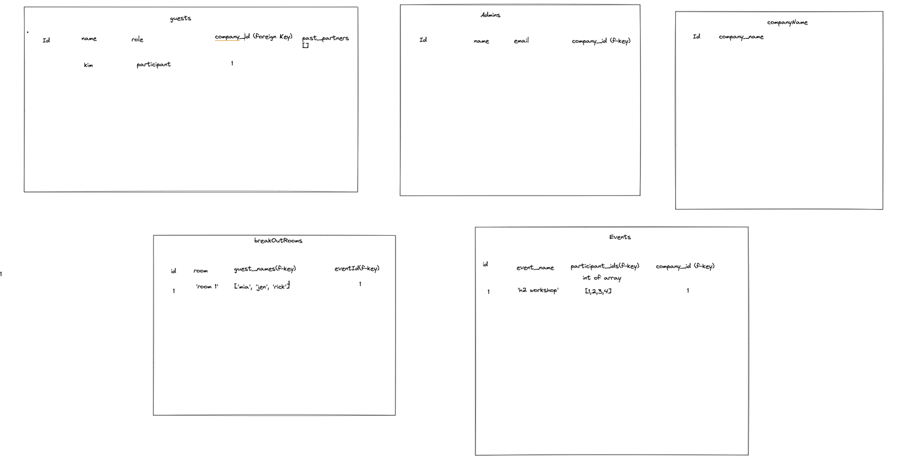

# Pringle Mingle

Pringle Mingle is a web application designed to help people meet as many people as they can during online events.   Pringle Mingle transforms an hour-long, headache inducing sorting process of creating groups of people who have met each other the least, into seconds with a simple, user-friendly interface, combined with an erudite database and sorting algorithm.


## Demo

https://server-6cav.onrender.com/

Log into Gmail with this test user.
| Email             | Password                                                              |
| ----------------- | ------------------------------------------------------------------ |
| highnote143@gmail.com | PringleMingleRocks!1 |

OR 

Create an account with your own organization email for full experience


## Features

- Organization email verification, allows for anyone with the organization email to access the same data and collaborate
- Send an invite to people who do not have an organization email so they can collaborate
- Upload csv files of names
- User Login with Auth0


## Tech Stack

<table align="center">
  <tr>
    <td align="center" width="96">
        
      <br>html
    </td>
    <td align="center" width="96">
        
      <br>CSS
    </td>
    <td align="center" width="96">
        
      <br>JavaScript
    </td>
    <td align="center" width="96">
        
      <br>postgreSQL
    </td>
    <td align="center" width="96">
        
      <br>Express
    </td>
    </tr>
  <tr>
    <td align="center" width="96">
        
      <br>React
    </td>
    <td align="center" width="96">
        
      <br>Node
    </td>
    <td align="center" width="96">
        
      <br>Bootstrap
    </td>
    <td align="center" width="96">
        
      <br>Render
    </td>
    <td align="center" width="96">
        
      <br>Email Js
    </td>
  </tr>
</table>


## Screenshots
Database Model
<<<<<<< HEAD

=======


>>>>>>> 8429fe27245aea35bbaa62ee1e92563904467ba0


## Installation

1. Clone the repo: 
   ```
   git clone https://github.com/MiaSmartyPants/Pringle_Mingle
   ```
2. Take out the owner's git:
    ```
    git init
    ```

3. Go to server folder 
    ```
    cd server
    ```

4. Install all NPM packages using this in the root directory:
    ```
    npm install
    ```
5. Database setup:
    - Inside your server folder, create an .env file with:
        ```
         touch .env
         ```
      
    - Inside your .env add:
        ```
         postgres://localhost:5432/final_project
         ```
    - Go Back to Terminal

    - Run the following to restore the DB dump file that the project already contain:
         ```
        psql -U postgres -f db.sql
         ```
6. Start the app by using in client and server folder:    
    ```
    npm start
    ```


## Testing
<<<<<<< HEAD

To run tests on the terminal:
* On client side run the following command:
    ```
    npm test
    ```


## Future Development
- Redirect user to dashboard after welcome in button is pressed
- CSS for tables and color scheme
- Redesign layout for displaying groups 
=======

To run tests on the terminal:
* On client side run the following command:
    ```
    npm test
    ```

>>>>>>> 8429fe27245aea35bbaa62ee1e92563904467ba0

## Future Development
- Redirect user to dashboard after welcome in button is pressed
- CSS for tables and color scheme
- Redesign layout for displaying groups 


